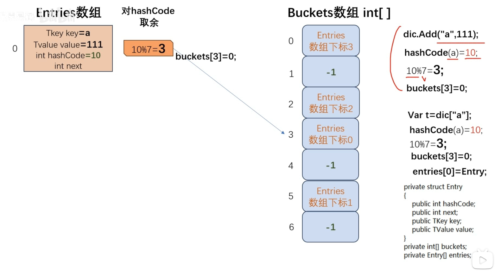

+++
title = "C# 字典底层实现原理"
date = "2026-09-08T10:05:00+08:00"
draft = false
slug = "csharp-dict-principle"
categories = ["Unity"]
tags = ["笔记", "C#", "字典", "Dictionary", "哈希表", "数据结构"]
+++

了解 C# `Dictionary` 实现原理之前，先了解 Hash 算法和解决 Hash 碰撞冲突。

## 一、Hash 算法基础

- **Hash 算法**
    - 用一个任意长度输入 → 通过 Hash 函数 → 得到一个统一长度的结果
- **Hash 表（散列表）**
    - 根据元素关键字计算出其在 Hash 表的存储地址
- **Hash 函数（散列函数）**
    - `Addr = HashFunc(Key)`，建立 Key-存储地址 的映射
- **Hash 冲突**
    - 本来应该是每个 Key 对应唯一的结果
    - 但是现在不同的 Key 会有相同的地址结果
- **雪崩效应**
    - 两个值非常接近的 Key 最终算出来的地址可能相差很大
    - 所以密码学 Hash 比较适合用来测试数据是否被改动过
    - 而数据结构 Hash 也需要用这个实现均匀分布和计算速度

## 二、关于字典的关键成员

右下角的就是 `Dictionary` 中关键成员：**Hash 桶数组 `buckets` + 键值对结构体数组 `entries`**。Hash 桶的作用就是存储 Entry 数组的下标。

当我们 `dict.Add("Age", 18)`：

1. 首先计算 `hashCode("Age") = 10`，算出 Key 哈希值
    - 传入 String 类型通过编码算出哈希值
    - 但也是有可能不同 String 算出相同哈希的
2. 然后 `10 % 7 = 3`
    - 对 7 取余因为图上的 `buckets` 数组长度为 7
        - 就是为了保证所有元素不超出 `buckets` 数组而已
    - 也就是以前讲过的散列算法
3. 得到 `buckets[3] = 0`
    - `buckets` 数组中存放的就是 `entries` 数组的下标
    - 直白点说 `Key == "Age"` 的键值对存放在 `entries[0]`，其下标存放在 `buckets[3]`

以后可能还有计算出 Key 为 `"Grade"` 的元素在 `entries[4]`，同样哈希余数为 3：

- 此时就会将其加入同一个桶 `buckets[3]` 的链表之中
- `entries[i]` 相当于 `LinkedNode`，其中存储了 `next` 索引
    - `entries[0]` 和 `entries[4]` 构成了链表
- 采用的是**头插法**
    - 注意 `buckets[3]` 并不存储链表本体，只存储链表头结点（最新插入 `entries[i]`）的索引

## 三、桶数组的意义

桶数组就相当于变相压缩了 `entries` 的索引——让 Key 哈希值余数相同的 `entries[i]` 放在同一个链表里。查找某个 Key，就先算出其 Key 哈希值余数为 3，然后到对应链表里面查找。

### 为啥不干脆查找 Key 为 "Age" 的 entries[i]

因为 `entries` 并没有按顺序排列，你只能遍历对比 `Key == "Age"`。

### 为什么不直接查找 Hash 值为 10 的元素

`buckets` 桶数组里面只变相存储了哈希值对长度取的余数。哈希值本身雪崩效应数值差距很大，总不能 10 ~ 18947 这些都存储吧？而且这样和直接找 Key 没啥区别了。

## 四、关于 entries 数组成员

### 为什么要存完整的 hashCode

找具体元素时要遍历链表，先比较 `HashCode`，如果和目标相同再比较 `Key`：

- string 类型的比较比 int 类型慢很多，所以先比较 `hashCode` 筛选一遍
- 不同 string 仍然可能有相同 `hashCode`（哈希冲突），所以还是得比较 `Key`

### 存储 next 下标

就是实现类似链表的结构。

## 五、查找时间复杂度

- **最好 / 平均 时间复杂度为 O(1)**
    - 链表只有一个元素（没有哈希冲突，没有余数相同）
    - 此时查找一个元素，直接算出其哈希值余数，就能找到索引
- **最坏时间复杂度为 O(n)**
    - n 个元素的哈希余数均相同，构成了一张长度 n 的链表
    - 查找某个元素就需要遍历链表了
