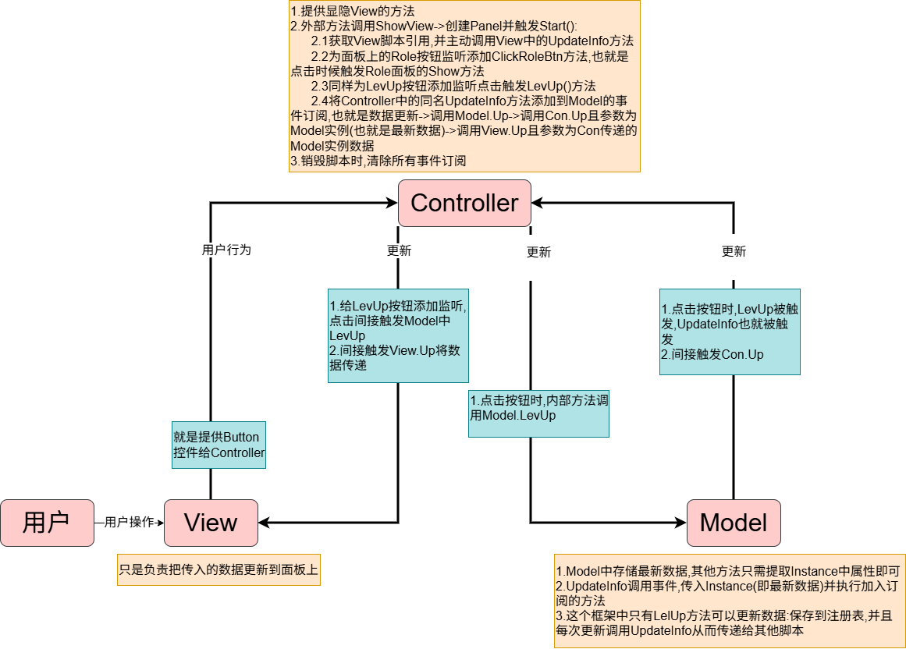

+++
title = "Unity MVC框架实现"
date = "2026-07-17T18:20:00+08:00"
draft = false
categories = ["Unity"]
tags = ["笔记", "设计模式", "MVC"]
+++

MVC（Model-View-Controller）是一种经典的设计模式，通过将数据、界面、逻辑分离，使代码结构更清晰、更易维护。本文展示在 Unity 中实现 MVC 框架的完整流程。



## 一、Model层：PlayerModel

Model 层主要负责存储和管理数据，不依赖 MonoBehaviour。这里使用单例模式保证数据唯一性，并通过事件机制通知外部更新。

```csharp
using System.Collections;
using System.Collections.Generic;
using UnityEngine;
using UnityEngine.Events;

//主要存储数据,不需要继承Mono
public class PlayerModel 
{
    //数据类具有唯一性,这里直接做成单例
    private static PlayerModel instance;

    public static PlayerModel Instance
    {
        get
        {
            if (instance == null)
            {
                instance = new PlayerModel();
                Instance.Init();
            }   
            return instance;
        }
    }
    
    //数据内容
    private string playerName;
    private int lev;
    private int atk;
    //事件用于Model通知外部数据更新,而非直接获取外部面板
    private event UnityAction<PlayerModel> updateEvent; 
    
    //每个变量都制作public属性方便外部访问
    public string PlayerName => playerName;
    public int Level => lev;
    public int Atk => atk;

    //初始化(和直接略过的一样使用PlayerPrefs)
    public void Init()
    {
        //查看项目注册表Key数值,默认为JOJO
        playerName = PlayerPrefs.GetString("PlayerName","JOJO");
        lev = PlayerPrefs.GetInt("PlayerLev", 1);
        atk = PlayerPrefs.GetInt("PlayerAtk", 20);
    }
    
    //更新
    public void LevUp()
    {
        //升级 改变内容
        lev += 1;
        atk += lev;
        //改变后自动调用保存方法
        SaveData();
        //当 Model 层的数据发生变化时，自动通知所有需要刷新界面的 UI 组件
        //UI只需要注册事件,不需要让这个Model层获取组件
        UpdateInfo();
    }
    
    //保存方法
    private void SaveData()
    {
        PlayerPrefs.SetInt("PlayerLev", lev);
        PlayerPrefs.SetInt("PlayerAtk", atk);
    }
    
    //增减事件监听的方法,外部传入有PlayerModel类型作为参数的方法
    //想要传入方法作为参数,肯定只能用委托啊笨
    public void AddEvent(UnityAction<PlayerModel> action)
    {
        updateEvent += action;
    }
    
    public void RemoveEvent(UnityAction<PlayerModel> action)
    {
        updateEvent -= action;
    }

    //通知外部更新数据的方法
    private void UpdateInfo()
    {
        if (updateEvent != null)
        {
            //PlayerModel的唯一实例Instance作为参数传入已经加入事件订阅的方法中
            //这些方法内部写明提取Instance的哪些属性就可以了
            updateEvent?.Invoke(this);
        }
    }
}
```

---

## 二、MainPanel：主面板的 View 与 Controller

### 1. MainView

View 层只负责获取控件和提供更新界面的方法，不处理任何业务逻辑。

```csharp
using System.Collections;
using System.Collections.Generic;
using UnityEngine;
using UnityEngine.UI;

//这个是针对MainPanel面板
public class MainView : MonoBehaviour
{
  //1.获取控件(挂载后关联控件)
  public Button btnRole;
  public Button btnSill;
  
  public Text txtName;
  public Text txtLev;
  public Text txtPower;
  //2.提供面板更新的方法给外部(外部调用UpdateInfo方法就可以修改类中数据了)
  //数据更新:这里传入PlayerModel中的最新数据,赋值到View
  //同样只是和PlayerModel中的UpdateInfo同名
  public void UpdateInfo(PlayerModel player)
  {
    txtName.text = player.PlayerName;
    txtLev.text = player.Level.ToString();
    txtPower.text = player.Atk.ToString();
  }
}
```

### 2. MainController

Controller 层负责界面的显隐、按钮事件绑定，以及接收 Model 数据并转发给 View。

```csharp
using System;
using System.Collections;
using System.Collections.Generic;
using Unity.VisualScripting;
using UnityEngine;

//挂载到MainPanel上
public class MainController : MonoBehaviour
{
   //获取View脚本
   private MainView mainView;
   
   private static MainController instance;

   public static MainController Instance
   {
      get
      {
         return instance;
      }
   }

   //1.界面的显隐
   public static void ShowView()
   {
      if (instance == null)
      {
         //实例化面板对象
         GameObject res = Resources.Load<GameObject>("UI/MainPanel");
         GameObject obj = Instantiate(res);
         //设置它的父对象 为Canvas
         obj.transform.SetParent(GameObject.Find("Canvas").transform, false);

         instance = obj.GetComponent<MainController>();
      }
      instance.gameObject.SetActive(true);
   }

   public static void HideView()
   {
      if (instance != null)
      {
         instance.gameObject.SetActive(false);
      }
   }

   //当调用ShowView->激活instance->Start周期函数自动调用
   private void Start()
   {
      //获取挂载在同一个对象上的view脚本,赋值给mainView
      mainView = this.GetComponent<MainView>();
      //第一次界面更新,主动将Model数据传给View,而不是等事件通知(保证面板有初始值)
      mainView.UpdateInfo(PlayerModel.Instance);
      //为btnRole添加监听,点击显示Role面板
      mainView.btnRole.onClick.AddListener(ClickRoleBtn);
      PlayerModel.Instance.AddEvent(UpdateInfo);
   }

   //点击按钮显示角色面板
   private void ClickRoleBtn()
   {
      RoleController.ShowView();
   }
   
   //收到PlayerModel传来的数据包,如果mainView不为空,则将其传入View面板更新
   //和PlayerInfo中的方法同名没有啥实际作用,只是为了代码简单
   private void UpdateInfo(PlayerModel player)
   {
      if (mainView != null)
      {
         mainView.UpdateInfo(player);
      }
   }

   private void OnDestroy()
   {
      PlayerModel.Instance.RemoveEvent(UpdateInfo);
   }
}
```

---

## 三、RolePanel：角色面板的 View 与 Controller

### 1. RoleView

```csharp
using System.Collections;
using System.Collections.Generic;
using UnityEngine;
using UnityEngine.UI;

//针对RolePanel面板的方法(需要挂载到物体上,所以还是要继承Mono的)
public class RoleView : MonoBehaviour
{
    public Button btnLevelUp;
    public Button btnClose;
    public Text txtLev;

    public void UpdateInfo(PlayerModel player)
    {
        txtLev.text = player.Level.ToString();
    }
}
```

### 2. RoleController

```csharp
using System.Collections;
using System.Collections.Generic;
using UnityEngine;
using UnityEngine.UI;

public class RoleController : MonoBehaviour
{
    private RoleView roleView;
    private static RoleController instance;

    public static RoleController Controller
    {
        get
        {
                return  instance;
        }
    }
    
       public static void ShowView()
       {
          if (instance == null)
          {
             GameObject res = Resources.Load<GameObject>("UI/RolePanel");
             GameObject obj = Instantiate(res);
             obj.transform.SetParent(GameObject.Find("Canvas").transform, false);
    
             instance = obj.GetComponent<RoleController>();
          }
          instance.gameObject.SetActive(true);
       }
    
       public static void HideView()
       {
          if (instance != null)
          {
             instance.gameObject.SetActive(false);
          }
       }
       
       void Start()
       {
          roleView = this.GetComponent<RoleView>();
          roleView.UpdateInfo(PlayerModel.Instance);
          roleView.btnClose.onClick.AddListener(ClickCloseBtn);
          roleView.btnLevelUp.onClick.AddListener(ClickLevUpBtn);
          PlayerModel.Instance.AddEvent(UpdateInfo);
       }
       
       private void ClickCloseBtn()
       {
         HideView();
       }
       
       private void ClickLevUpBtn()
       {
         PlayerModel.Instance.LevUp();
       }

       private void UpdateInfo(PlayerModel player)
       {
          if(roleView != null)
          {
             roleView.UpdateInfo(player);
          }
       }
}
```

---

## 四、测试入口：MVCTest

负责调用 MainController，通过键盘按键控制主面板的显示与隐藏。

```csharp
using System.Collections;
using System.Collections.Generic;
using UnityEngine;

public class MVCTest : MonoBehaviour
{
    void Start()
    {
        
    }
    
    void Update()
    {
        if (Input.GetKeyDown(KeyCode.J))
        {
            MainController.ShowView();
        }
        else if (Input.GetKeyDown(KeyCode.K))
        {
            MainController.HideView();
        }
    }
}
```

---

## 五、MVC 数据流向总结

1. **View → Controller**：用户在界面上点击按钮，View 上的事件被 Controller 监听并处理
2. **Controller → Model**：Controller 调用 Model 的方法（如 `LevUp()`）修改数据
3. **Model → Controller**：Model 数据变化后通过事件通知所有订阅者
4. **Controller → View**：Controller 接收更新后，调用 View 的 `UpdateInfo()` 刷新界面

整个流程中，Model 不依赖 View，View 不直接操作 Model，Controller 作为中间层协调两者，实现了数据与界面的解耦。
