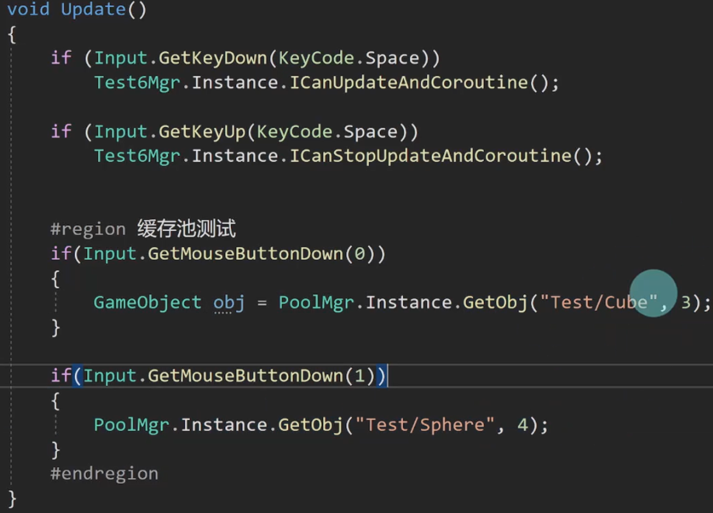

+++
title = "Unity对象缓存池实现"
date = "2026-07-17T22:56:00+08:00"
draft = false
categories = ["Unity"]
tags = ["笔记", "对象池", "设计模式", "优化"]
+++

对象池（Object Pool）是游戏开发中提升性能的核心技术，通过复用对象避免频繁实例化和销毁。本文按 **基本实现 → 布局优化 → 上限优化** 三个迭代版本，逐步演进一个完整的 Unity 对象缓存池。

## 一、基本实现

最基础的对象池，使用 `Dictionary<string, Stack<GameObject>>` 存储对象，支持取出和归还。

### 1. 单例基类 BaseSingleton

```csharp
using System.Collections;
using System.Collections.Generic;
using UnityEngine;

public class BaseSingleton<T> : MonoBehaviour where T : MonoBehaviour
{
    //继承Mono的单例基类,肯定不需要私有化构造函数啊
   private static T _instance;

   public static T Instance
   {
       get
       {
           if (_instance == null)
           {
               _instance = FindObjectOfType<T>();
               if (_instance == null)
               {
                   GameObject obj = new GameObject(typeof(T).Name);
                   _instance = obj.AddComponent<T>();
                   DontDestroyOnLoad(obj);
               }
           }
           return _instance;
       }
   }
   
   protected virtual void Awake()
   {
       if (_instance == null)
       {
           _instance = this as T;
           DontDestroyOnLoad(this.gameObject);
       }
       else
       {
           Destroy(this.gameObject);
       }
       Debug.Log("单例基类启动");
   }
   
   protected virtual void OnDestroy()
   {
       if (_instance == this)
       {
           _instance = null;
       }
   }
}
```

### 2. 对象池管理器 PoolMgr

```csharp
using System.Collections;
using System.Collections.Generic;
using UnityEngine;

public class PoolMgr : BaseSingleton<PoolMgr>
{
   //注意这里值是Stack<GameObject>
   private Dictionary<string,Stack<GameObject>> poolDic = new Dictionary<string,Stack<GameObject>>();
   //取出物体的方法
   public GameObject GetObj(string name)
   {
      GameObject obj;
      if (poolDic.ContainsKey(name) && poolDic[name].Count > 0)
      {
         //字典只是更改引用,并不会真正修改游戏物体内存位置
         obj = poolDic[name].Pop();
         obj.SetActive(true);
      }
      else
      {
         obj = GameObject.Instantiate(Resources.Load<GameObject>(name));
         obj.name = name;
      }
      return obj;
   }
   //放入东西的方法
   public void SetObj(string name, GameObject obj)
   {
      obj.SetActive(false);
      if (poolDic.ContainsKey(name))
      {
         //这里是在 poolDic[name]对应栈中取出对象
         poolDic[name].Push(obj);
      }
      else
      {
         //需要添加的是新栈,不仅仅是游戏物体
         poolDic.Add(name, new Stack<GameObject>());
         //这里是在 poolDic[name]对应栈中压入对象
         poolDic[name].Push(obj);
      }
   }

   public void Clear()
   {
      poolDic.Clear();
   }

   
}
```

**本版特点：**
- 使用 `Stack<GameObject>` 存储未使用对象，后进先出
- `GetObj`：栈中有则取出激活，没有则实例化
- `SetObj`：失活后压入栈中
- **不足**：所有对象散落在场景根层级，Hierarchy 面板混乱

---

## 二、布局优化

引入 `PoolData` 封装类，为每种对象创建独立的根节点，形成 `Pool → 各类根节点 → 对象` 的层级结构，保持 Hierarchy 整洁。

### 1. 单例基类 BaseManager

```csharp
using System.Collections;
using System.Collections.Generic;
using UnityEngine;

public class BaseManager<T> :MonoBehaviour  where T :MonoBehaviour
{
    private static T _instance;

    public static T Instance
    {
        get
        {
            if (_instance == null)
            {
                //手动寻找场景中脚本
                _instance = FindObjectOfType<T>();
                //找不到就创建
                if (_instance == null)
                {
                    //直接用继承的Manager来命名
                    GameObject obj = new GameObject(typeof(T).Name);
                    _instance = obj.AddComponent<T>();
                    //脚本是固定在obj物体上,所以保留obj
                    DontDestroyOnLoad(obj);
                }
            }
            return _instance;
        }
    }

    protected virtual void Awake()
    {
        if (_instance == null)
        {
            _instance = this as T;
            DontDestroyOnLoad(this.gameObject);
        }
        else
        {
            Destroy(this.gameObject);
        }
    }

    public static void Clear()
    {
        _instance = null;
    }
}
```

### 2. 封装类 PoolData

```csharp
using System.Collections.Generic;
using UnityEngine;

//PoolData封装,是把栈+每个栈的根对象封装为一块
public class PoolData 
{
    //用于存储每个栈中的对象
    private Stack<GameObject> dataStack = new Stack<GameObject>();
    //每个栈的根对象
    private GameObject rootObj;
    //属性用于检查每个栈中是否还有对象
    public int Count
    {
        get
        {
            return dataStack.Count;
        }
    }
    //弹出数据的方法:弹出栈,激活对象,取消父子关系
    public GameObject PopData()
    {
        GameObject obj = dataStack.Pop();
        obj.SetActive(true);
        //如果开启布局功能
        if (PoolMgrLayout.isOpenLayout)
        {
            //每个栈对应仅一个Root根物体,取出的时候自然设置物体父物体为空
            obj.transform.SetParent(null);
        }
        return obj;
    }
    //压入数据的方法:失活物体,设置父类,压入栈中
    public void PushData(GameObject obj)
    {
        obj.SetActive(false);
        //压入栈同样将这个栈对应的根节点设置为该物体父节点,然后压入栈
        obj.transform.SetParent(rootObj.transform);
        dataStack.Push(obj);
    }
    //构造函数:这个构造函数就是专门给每个栈创建对应的根节点的
    //前面的rootObj除了设置父子关系,就是用来在这里接收创建的根节点
    public PoolData(GameObject root, string name)
    {
        if (PoolMgrLayout.isOpenLayout)
        {
            //比如Bullet物体,这里就创建个名叫Bullet的根节点,并且设置为总根节点的子物体
            rootObj = new GameObject(name);
            rootObj.transform.SetParent(root.transform);
        }
    }
}
```

### 3. 管理器 PoolMgrLayout

```csharp
using System.Collections;
using System.Collections.Generic;
using UnityEngine;

public class PoolMgrLayout : BaseManager<PoolMgrLayout>
{
   protected override void Awake()
   {
      base.Awake();
      print("哔哔哔...对象池模块(布局优化)");
   }
   
   //是否开启自动布局功能
   public static bool isOpenLayout = true;
   //这里直接将游戏物体栈Stack<GameObject>换成了PoolData类对象(封装思想)
   private Dictionary<string,PoolData> poolDic = new Dictionary<string, PoolData>();
   //poolObj 始终指代的是最高层级根节点
   private GameObject poolObj;
   //获取游戏物体
   public GameObject GetObj(string name)
   {
      GameObject obj;
      //注意依旧poolDic[name]是一整个栈,这里poolDic[name].Count检测value栈数量
      //poolDic[name].PopData()则是弹出value栈中的一个元素
      if (poolDic.ContainsKey(name) && poolDic[name].Count > 0)
      {
         //注意这里是调用了PoolData类中的PopData方法
         obj = poolDic[name].PopData();
         //这里物体激活和设置父对象为空已经在封装类PoolData中实现,不需要写了
      }
      else
      {
         obj = GameObject.Instantiate(Resources.Load<GameObject>(name));
         obj.name = name;
      }
      return obj;
   }
//设置游戏物体
   public void SetObj(string name, GameObject obj)
   {
      //首先要检查最高层级节点是否已经创建(方便下面创建栈root并设置为其根节点)
      if (poolObj == null && isOpenLayout)
      {
         poolObj = new GameObject("Pool");
      }
      //检查是否已经有同名物体
      if (poolDic.ContainsKey(name))
      {
         //调用PoolData中的PushData方法(poolDic[name]是一个完整的poolData对象实例)
         poolDic[name].PushData(obj);
         //同样因为封装对象中已经写入,不需要写物体失活和设置父物体了
      }
      else
      {
         //只有这里会访问PoolData的构造函数
         //如果没有指定name层的栈,就触发构造函数
         //根节点名为obj.name并将root设为总root子物体
         poolDic.Add(name,new PoolData(poolObj, obj.name));
         poolDic[name].PushData(obj);
      }
   }
//这个Clear并没有真正销毁(可能内存泄露),还需要改进
   public void ClearPool()
   {
      poolDic.Clear();
   }
   //这里选用继承了Mono的单例基类,就不使用构造函数了
}
```

**本版特点：**
- `PoolData` 封装 `Stack` 与 `rootObj`，职责单一
- 层级结构：`Pool`（总根）→ `Bullet`/`Enemy`（各类根）→ 对象
- `isOpenLayout` 开关控制是否启用层级整理
- **不足**：无数量上限，持续获取会无限创建对象

---

## 三、上限优化

在布局优化基础上，新增 `usedList` 记录使用中的对象，通过 `max` 参数限制最大数量，超限时复用最旧的对象。

### 1. 封装类 PoolDataUpper

```csharp
using System.Collections.Generic;
using UnityEngine;

public class PoolDataUpper 
{
    //原来只记录栈中对象(也就是没有被使用的对象)
    private Stack<GameObject> dataStack = new Stack<GameObject>();
    //现在新增List记录使用中对象(便于随机访问,记录使用的先后)
    private List<GameObject> usedList = new List<GameObject>(); 
    private GameObject rootObj;
    
    public int Count
    { //原来只是用Count属性检测栈中对象数量
        get => dataStack.Count;
    }
    public int UsedCount
    {//现在新增属性用于检测正在使用中的物体数量
        get => usedList.Count;
    }
    
    public GameObject PopData()
    {
        GameObject obj;
        //修改版的PoolMgr不再判断Count,交给PoolData管理
        if (Count > 0)
        {
            //栈中尚有余量,直接取出就行,并添加到使用列表
            obj = dataStack.Pop();
            usedList.Add(obj);
        }
        else
        {
            //栈中为空则没有能取出的备用物体,从正在使用物体中最老的开始取出
            obj = usedList[0]; 
            //只是复制到obj还不够,需要把usedList首位本体删除,然后obj添加到List末尾
            usedList.RemoveAt(0); 
            usedList.Add(obj);    
        }
        //如果是Count==0的情况,这行就是冗余的,不过也算保证了代码的统一吧
        obj.SetActive(true);
        if (PoolMgrLayout.isOpenLayout)
        {
            obj.transform.SetParent(null);
        }
        return obj;
    }
    
    public void PushData(GameObject obj)
    {
        obj.SetActive(false);
        obj.transform.SetParent(rootObj.transform);
        dataStack.Push(obj);
        //新增从usedList中移除
        usedList.Remove(obj);
    }
    //构造函数新增usedObj参数,以及调用对象压入使用中容器函数
    public PoolDataUpper(GameObject root, string name, GameObject usedObj)
    {
        if (PoolMgrLayout.isOpenLayout)
        {
            rootObj = new GameObject(name);
            rootObj.transform.SetParent(root.transform);
        }
        PushUsedList(usedObj);
    }
    //GetObj取物体->没有对应栈->首次创建栈完毕直接加入使用列表
    public void PushUsedList(GameObject obj) 
    {
        usedList.Add(obj);
    }
}
```

### 2. 管理器 PoolMgrUpper

```csharp
using System.Collections;
using System.Collections.Generic;
using UnityEngine;

public class PoolMgrUpper : BaseManager<PoolMgrUpper>
{
   protected override void Awake()
   {
      base.Awake();
      print("哔哔哔...对象池模块(上限优化)");
   }
   
   public static bool isOpenLayout = true;
   private Dictionary<string,PoolDataUpper> poolDic = new Dictionary<string, PoolDataUpper>();
   private GameObject poolObj;
   //获取物体时新增最大数量
   public GameObject GetObj(string name,int max = 50)
   {
      GameObject obj;
      //防止bug,把这段从SetObj中移动到GetObj中
      if (poolObj == null && isOpenLayout)
      {
         poolObj = new GameObject("Pool");
      }
      
      //新增判断 有栈没对象,使用中对象没有超上限
      //if (poolDic.ContainsKey(name) && poolDic[name].Count > 0) 旧版:有要取的物体对应栈+栈中有对象直接用,没有就先创建
      //新版:如果没有取出物体对应栈 或 备用栈空且使用中物体未满->先创建新物体
      //UsedList满则不创建新物体,而是直接从旧的里面取,UsedList未满则直接创建新物体
      if (!poolDic.ContainsKey(name) || (poolDic[name].Count == 0 && poolDic[name].UsedCount < max)) 
      {
         obj = GameObject.Instantiate(Resources.Load<GameObject>(name));
         obj.name = name;
         //进一步判断,如果是没有对应栈
         if (!poolDic.ContainsKey(name))
         {
            //调用PoolDataUpper构造函数,执行之前操作并把新物体送入usedList
            poolDic.Add(name, new PoolDataUpper(poolObj, name,obj));
         }
         else
         {
            //有对应栈就不需要执行创建了,直接新物体送入usedList
            poolDic[name].PushUsedList(obj);
         }
      }
      //不需要创建新物体的逻辑都在这里
      else
      {
         obj = poolDic[name].PopData();
      }
      return obj;
   }
   //SetObj已经不需要写逻辑了
   public void SetObj(string name, GameObject obj)
   {
      //第一次获取对象
   }
   
   public void ClearPool()
   {
      //这里只是清空字典引用,导致严重内存泄露,虽然我懒得管了
      poolDic.Clear();
   }
}
```

### 3. 测试方法



**本版特点：**
- 新增 `usedList` 记录使用中的对象，支持随机访问
- `GetObj` 新增 `max` 参数（默认 50），控制最大对象数量
- 栈空且使用中未满 → 创建新对象；使用中已满 → 复用最旧对象（`usedList[0]`）
- `SetObj` 逻辑简化，归还时从 `usedList` 移除并压入栈
- **注意**：`ClearPool` 仅清空字典引用，未真正销毁对象，存在内存泄漏

---

## 四、三版演进对比

| 特性 | 基本实现 | 布局优化 | 上限优化 |
|------|---------|---------|---------|
| 数据结构 | `Stack<GameObject>` | `PoolData`（封装 Stack + rootObj） | `PoolDataUpper`（Stack + usedList） |
| 层级管理 | 无，对象散落 | `Pool → 类根 → 对象` | 同左 |
| 数量控制 | 无上限 | 无上限 | `max` 参数限制 |
| 对象复用 | 仅复用栈中对象 | 仅复用栈中对象 | 栈空时复用使用中最旧对象 |
| 封装程度 | 直接操作 Stack | PoolData 封装 | PoolDataUpper 封装 + 双容器 |

**演进思路：**
1. **基本实现**解决"避免频繁实例化"的问题
2. **布局优化**解决"Hierarchy 混乱"的问题，引入封装类
3. **上限优化**解决"无限创建对象"的问题，引入使用中列表和数量上限
