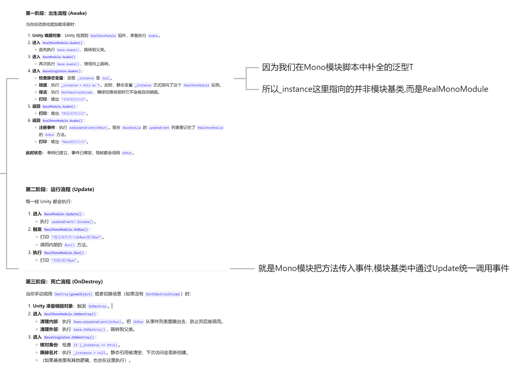

+++
title = "Unity公共Mono模块"
date = "2026-07-17T22:30:00+08:00"
draft = false
categories = ["Unity"]
tags = ["笔记", "设计模式", "Mono模块", "单例模式"]
+++

在 Unity 开发中，许多管理器需要利用 MonoBehaviour 的生命周期函数（如 `Update`、`Awake`、`OnDestroy`）来实现每帧逻辑。公共 Mono 模块通过 **单例基类 → 模块基类 → 具体模块** 三层结构，将 Mono 能力统一封装，供所有非 Mono 脚本复用。



上图展示了三个类的完整执行流程，分为三个阶段：
- **出生流程（Awake）**：从 `RealMonoModule` 向上调用到 `BaseSingleton`，完成单例初始化和事件注册
- **运行流程（Update）**：`BaseModule` 的 `Update` 通过事件统一调用 `RealMonoModule` 的逻辑
- **死亡流程（OnDestroy）**：先移除事件监听，再清空单例引用，防止空指针报错

## 一、单例基类：BaseSingleton

最底层的单例基类，提供自动创建实例、场景切换不销毁、重复实例自动销毁等基础能力。

```csharp
using System.Collections;
using System.Collections.Generic;
using UnityEngine;

public class BaseSingleton<T> : MonoBehaviour where T : MonoBehaviour
{
    //继承Mono的单例基类,肯定不需要私有化构造函数啊
   private static T _instance;

   public static T Instance
   {
       get
       {
           if (_instance == null)
           {
               _instance = FindObjectOfType<T>();
               if (_instance == null)
               {
                   GameObject obj = new GameObject(typeof(T).Name);
                   _instance = obj.AddComponent<T>();
                   DontDestroyOnLoad(obj);
               }
           }
           return _instance;
       }
   }
   
   protected virtual void Awake()
   {
       if (_instance == null)
       {
           _instance = this as T;
           DontDestroyOnLoad(this.gameObject);
       }
       else
       {
           Destroy(this.gameObject);
       }
       Debug.Log("单例基类启动");
   }
   
   protected virtual void OnDestroy()
   {
       if (_instance == this)
       {
           _instance = null;
       }
   }
}
```

**核心功能：**
- 泛型约束 `where T : MonoBehaviour`，确保子类是 MonoBehaviour
- 访问 `Instance` 时自动查找或创建 GameObject
- `Awake` 中处理重复实例销毁与 `DontDestroyOnLoad`
- `OnDestroy` 中清空静态引用，防止销毁后访问报错

---

## 二、模块基类：BaseModule

在单例基类之上扩展，通过事件机制向外提供 `Update` 每帧回调，让非 Mono 脚本也能拥有"每帧执行"的能力。

```csharp
using System.Collections;
using System.Collections.Generic;
using UnityEngine;
using UnityEngine.Events;

//这里类名也需要是泛型而不是直接继承BaseSingleton<BaseModule>
public class BaseModule<T> : BaseSingleton<T>where T:MonoBehaviour
{  
  private event UnityAction updateEvent;
  
  protected override void Awake()
  {
    base.Awake();
    Debug.Log("模块基类启动");
  }
  
  private void Update()
  {
    updateEvent?.Invoke();
  }
  
  public void AddUpdateEvent(UnityAction action)
  {
    updateEvent += action;
  }
  
  public void RemoveUpdateEvent(UnityAction action)
  {
    updateEvent -= action;
  }
}
```

**核心功能：**
- 继承 `BaseSingleton<T>`，同时具备单例能力
- 通过 `updateEvent` 事件，将自身的 `Update` 生命周期暴露给外部
- 外部脚本可通过 `AddUpdateEvent` / `RemoveUpdateEvent` 注册和注销每帧逻辑
- 注意：类名必须是泛型 `BaseModule<T>`，而非直接继承 `BaseSingleton<BaseModule>`，否则每个子类会共享同一个单例

---

## 三、具体模块：RealMonoModule

实际使用的模块脚本，继承 BaseModule，通过注册事件的方式实现每帧逻辑。

```csharp
using System;
using System.Collections;
using System.Collections.Generic;
using UnityEngine;

public class RealMonoModule :BaseModule<RealMonoModule>
{
    protected override void Awake()
    {
        base.Awake();
        // 注册Mono模块更新逻辑,这里直接传入Run也是可以的
        //主要是和属性一样修改更加方便
        AddUpdateEvent(OnRun);
        Debug.Log("Mono模块启动");
      
    }
    
    private void OnRun()
    { 
       Debug.Log("通过事件传入OnRun调用Run");
      //每帧调用的逻辑
       Run();
    }

    private void Run()
    {
        Debug.Log("每帧调用Run");
    }

    //该类的摧毁:移除事件列表+移除外部调用单例对象
    protected void OnDestroy()
    {
        RemoveUpdateEvent(OnRun);
        //_instance本来是== RealMonoModule 
        //现在移除引用,后面初始化时就会通过if(_instance == null)
        //防止RealMonoModule.Instance.Run()报错
        base.OnDestroy();
    }
}
```

**核心功能：**
- 继承 `BaseModule<RealMonoModule>`，自动获得单例与 Update 事件能力
- `Awake` 中通过 `AddUpdateEvent(OnRun)` 注册每帧回调
- `OnRun` 作为事件回调，内部调用实际的每帧逻辑 `Run()`
- `OnDestroy` 中先移除事件监听，再调用基类清空单例引用，避免销毁后空引用

---

## 四、三层结构总结

```
BaseSingleton<T>        ← 单例基类：自动创建、不销毁、防重复
    ↑
BaseModule<T>           ← 模块基类：暴露 Update 事件给外部
    ↑
RealMonoModule          ← 具体模块：注册每帧逻辑、处理销毁
```

**设计思路：**
1. **BaseSingleton** 解决"谁来做单例"的问题——自动创建 GameObject 并挂载
2. **BaseModule** 解决"非 Mono 脚本如何每帧执行"的问题——通过事件暴露 Update
3. **RealMonoModule** 解决"具体做什么"的问题——注册业务逻辑

**使用场景：**
- 纯 C# 管理器（如数据管理、网络管理）需要每帧更新时，无需自己继承 MonoBehaviour
- 统一管理所有模块的生命周期，避免场景中散落大量 MonoBehaviour 脚本
- 通过事件注册/注销机制，灵活控制每帧逻辑的启停
